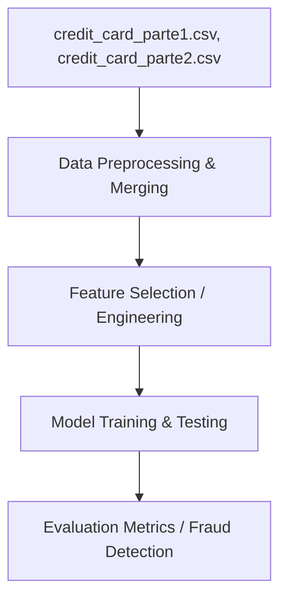

# Credit Card Fraud Analysis

[](https://jupyter.org/)
[](https://www.python.org/)

## Table of Contents

- [Context](#-context)
- [Software features](#-software-features)
- [Technologies and tools](#-technologies-and-tools)
- [Architecture](#-architecture)
- [Repository structure](#-repository-structure)
- [Requirements](#-requirements)
- [How to run](#-how-to-run)
- [Author](#-author)

# 📌 Context 

This project was developed as part of the Programming Paradigms course in the 6th semester of the Information Systems degree at Centro Universitário Senac. The group decided to build a project using Big Data and AI, focusing on analyzing credit card fraud data to train and test machine learning models.

## 🚀 Software features

- **Data Merging & Preprocessing:** Combines multiple large CSV datasets of transaction records.
- **Data Exploration:** Visualizes features and labels to understand transaction distributions.
- **Model Training & Evaluation:** Trains a machine learning model to classify transactions as either legitimate or fraudulent, and tests its predictive performance.

## 🛠️ Technologies and tools

- Python 3
- Jupyter Notebook
- Pandas
- NumPy
- Scikit-learn
- Matplotlib / Seaborn

## 📋 Architecture



## 📂 Repository structure

```text
- 📂 ds-credit-fraud/
  - 📂 data/
    - 📄 credit_card_parte1.csv (First part of the transaction dataset)
    - 📄 credit_card_parte2.csv (Second part of the transaction dataset)
  - 📄 main.ipynb (Jupyter Notebook with code and analyses)
```

## 📦 Requirements

- Python 3.10+
- Jupyter Notebook or JupyterLab
- Essential Python packages (`pandas`, `numpy`, `scikit-learn`, `matplotlib`, `seaborn`)

## ⚙️ How to run

### 1. Clone the Repository
Clone the repository to your local machine:
```bash
git clone https://github.com/MatheusRodri/ds-credit-fraud.git
cd ds-credit-fraud
```

### 2. Set Up a Virtual Environment (Optional but Recommended)
Create and activate a virtual environment to isolate the project dependencies:

**On Windows (PowerShell):**
```powershell
python -m venv venv
.\venv\Scripts\Activate.ps1
```

**On Windows (Command Prompt):**
```cmd
python -m venv venv
.\venv\Scripts\activate.bat
```

**On Linux/macOS:**
```bash
python3 -m venv venv
source venv/bin/activate
```

### 3. Install Dependencies
Install all the required Python libraries:
```bash
pip install pandas numpy scikit-learn matplotlib seaborn jupyter
```

### 4. Run the Project
1. Start Jupyter Notebook:
   ```bash
   jupyter notebook
   ```
2. In the browser interface that opens, open `main.ipynb`.
3. Run all the notebook cells sequentially to execute the data preprocessing, model training, and performance evaluations.

## 👤 Author

Matheus Rodrigues 
[LinkedIn](https://linkedin.com/in/matheus-rodrigues-mrj) [GitHub](https://github.com/MatheusRodri)